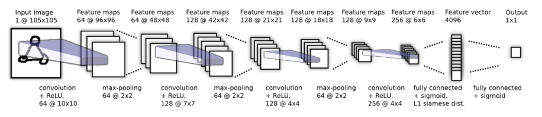

# Facial Recognition using Siamese Network
Facial Recognition using Siamese Network | Tensorflow

## Introduction
- Overview of the significant advancements in facial recognition technology.
- Identification of common applications, including security systems and user authentication.
- Recognition of the challenge posed by the need for large datasets for effective system operation.

## Model Architecture
The model architecture consists of Input Layer of shape (105,105,3), 4 2D- convolution layers, 4 Max Pooling layers, L1 siamese distance calc layer, 1 fully connected layer, 1 sigmoid layer and then output layer having single output

## Dataset
For training & testing of the model we have used Labeled Faces in the Wild, a database of face photographs designed for studying the problem of unconstrained face recognition. The dataset contains more than 13,000 images of faces collected from the web. Each face has been labeled with the name of the person pictured. 1680 of the people pictured have two or more distinct photos in the data set.

## Applications
- CCTV Cameras
- Door locking systems
- Personal devices locks